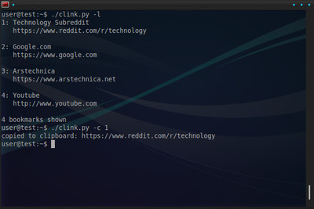

Clink
=====

Clink is a little Python script that lets you manage your bookmarks from the terminal. It's quick, easy, and local - all those bookmarks are stored in a plain text file on your computer. Here's what you can do with Clink:

* Save URLs directly from the clipboard
* Copy URLs directly to the clipboard
* List all your bookmarks in a neat-o format
* Find the ones concerning, say, "nyancat" with a search

How to Use
----------

**Adding:** Select and copy the URL that you want to save. At the terminal, type `clink.py -a title` where _title_ is the name for the bookmark (I usually use the title of the page that the URL points to). Press enter and you're done - the title and URL in the clipboard are saved in 'links.txt' as a bookmark. If you don't specify a title, the current date will be used.

**Listing:** View all your entries with `clink.py -l`. You'll see a number at the side of each bookmark - this will be useful for a few other commands.

**Copying URLs:** Use `clink.py -c ID`, where _ID_ is the number associated with the bookmark. Then simply paste as needed.

**Deleting:** `clink.py -d ID`. You'll be asked for confirmation.

**Searching:** `clink.py -f youtube`. Returns all the bookmarks with 'youtube' in the title or URL, plus the total number of matches. Not case-sensitive.

**\*Tagging:** I considered doing a tagging feature, but I realized that it suffices to include something like _@technology_ in the title of relevant bookmarks, then do a search for bookmarks 'tagged' _@technology_ later on as needed.

Requirements
------------

* Clink uses Al Sweigart's cross-platform _Pyperclip_ module for clipboard handling (good stuff Al). I've included it in this repo.
* On Linux, you need to have either the _xclip_ or _xsel_ program installed.

- - - -

Happy bookmarking!
